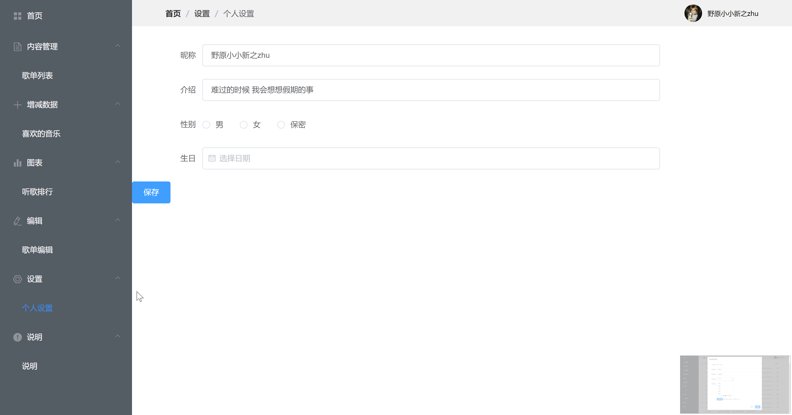

# vue-cms
基于vue3+elementui实现的后台管理系统

#### 技术栈：vue3+elementui+vuex+fetch+vue-router

后台数据来源于[网易云音乐 NodeJS 版 API](https://neteasecloudmusicapi.vercel.app/#/)

[在线地址](http://118.193.37.162/vue-cms/index.html)

打开稍微有点慢，请耐心等待

